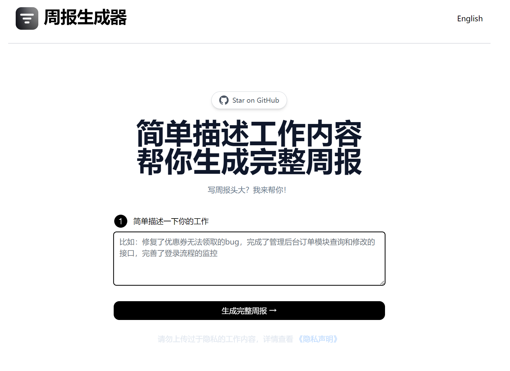
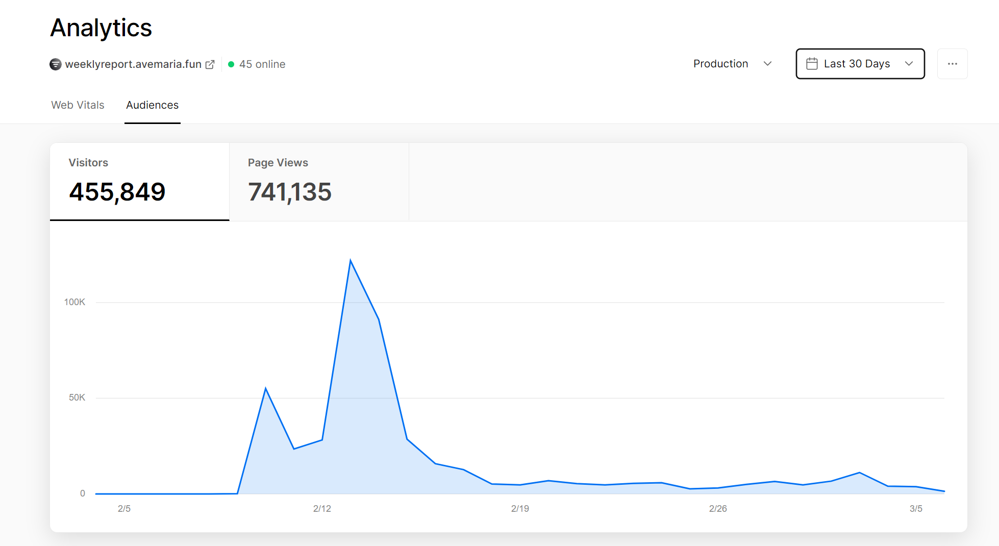
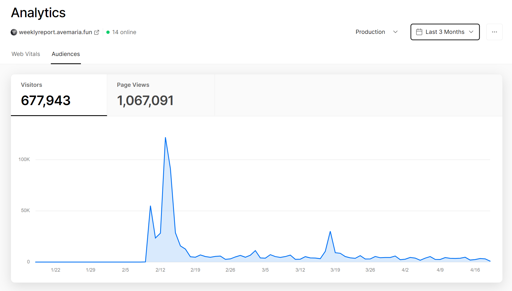

# [Weekly Report](https://weeklyreport.avemaria.fun/)

## [English](README_EN.md)

简单描述工作内容，帮你生成完整周报

[](https://weeklyreport.avemaria.fun/zh)

## 这个项目是如何工作的
这个项目主要使用了 [OpenAI GPT-3.5 API](https://platform.openai.com/docs/introduction) 和 [Vercel Edge functions](https://vercel.com/features/edge-functions)。它根据用户输入构建一个 Prompt，通过 Vercel Edge 函数将其发送到 GPT-3.5 API，然后将响应流传回应用程序。

## 在本地运行

**由于众所周知的原因，OpenAI API 的域名 api.openai.com 已无法在大陆网络环境下访问，本地调试需要自己想办法。如果你有好的想法欢迎提PR**

clone 此 repo，去 [OpenAI](https://beta.openai.com/account/api-keys) 注册一个账号，拿到 API key，放到 `.env` 文件。本地文件 `.env.example` 要改成 `.env`。


确保你本地的 npm 命令生效，执行以下命令
```bash
npm install
npm run dev
```
打开 `http://localhost:3000`


## 线上一键部署

用 [Vercel](https://vercel.com?utm_source=github&utm_medium=readme&utm_campaign=vercel-examples) 一键部署:

[](https://vercel.com/new/clone?repository-url=https://github.com/guaguaguaxia/weekly_report&env=OPENAI_API_KEY,NEXT_PUBLIC_USE_USER_KEY&project-name=weekly_report&repo-name=weekly_report)

环境变量如下所示：
```
OPENAI_API_KEY=xxxxx
NEXT_PUBLIC_USE_USER_KEY = false  
```

## Docker 部署

```bash
docker run -d -p 3000:3000 --name weekly_report-docker -e OPENAI_API_KEY=sk-xxxxx ihxrainbow/weekly_report-docker
```

docker-compose.yml
```yaml
services:
  weekly_report-docker:
    container_name: weekly_report-docker
    ports:
      - '3000:3000'
    image: ihxrainbow/weekly_report-docker
    environment:
      # API key
      - OPENAI_API_KEY=sk-xxxxx
```

<!-- https://www.seotraininglondon.org/gpt3-business-email-generator/ -->

## 一些数据
### 2023-03-06


### 2023-04-19



## 感谢

受 [TwtterBio](https://github.com/Nutlope/twitterbio) 和 [chat-simplifier](https://github.com/zhengbangbo/chat-simplifier) 启发.


