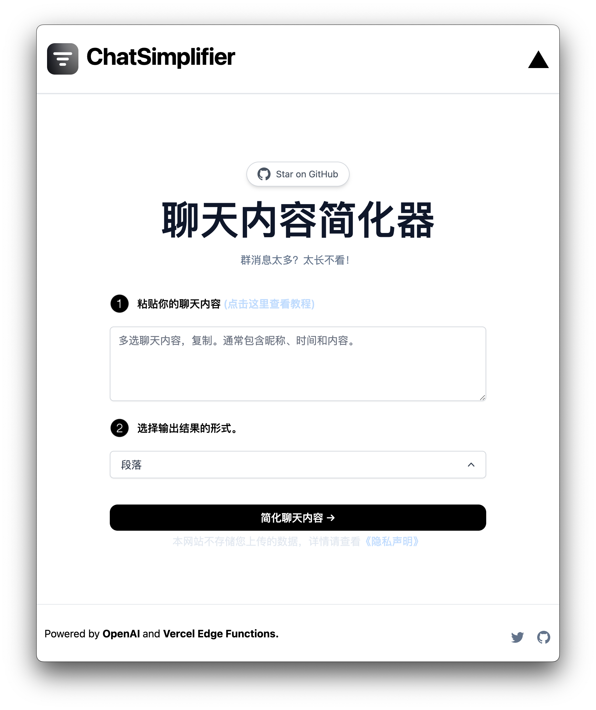

# [Chat Simplifier](https://chat-simplifier.vercel.app/)
[](https://chat.imzbb.cc)

This project simplify chat content for you using AI.

[](https://chat-simplifier.vercel.app/)

## How it works

This project uses the [OpenAI GPT-3 API](https://openai.com/api/) (specifically, text-davinci-003) and [Vercel Edge functions](https://vercel.com/features/edge-functions) with streaming. It constructs a prompt based on the form and user input, sends it to the GPT-3 API via a Vercel Edge function, then streams the response back to the application.

## Running Locally

After cloning the repo, go to [OpenAI](https://beta.openai.com/account/api-keys) to make an account and put your API key in a file called `.env`.

Then, run the application in the command line and it will be available at `http://localhost:3000`.

```bash
npm run dev
```

## One-Click Deploy

Deploy the example using [Vercel](https://vercel.com?utm_source=github&utm_medium=readme&utm_campaign=vercel-examples):

[](https://vercel.com/new/clone?repository-url=https%3A%2F%2Fgithub.com%2Fzhengbangbo%2Fchat-simplifier&env=OPENAI_API_KEY,NEXT_PUBLIC_USE_USER_KEY,OPENAI_MODEL&envDescription=%E7%82%B9%E5%87%BB%E5%8F%B3%E4%BE%A7%E3%80%8CLearn%20More%E3%80%8D%E6%9F%A5%E7%9C%8B%E7%8E%AF%E5%A2%83%E5%8F%98%E9%87%8F%E8%AF%B4%E6%98%8E&envLink=https%3A%2F%2Fgithub.com%2Fzhengbangbo%2Fchat-simplifier%2Fwiki%2FDeploy&project-name=chat-simplifier&repository-name=chat-simplifier)

## Credits

Inspired by [TwtterBio](https://github.com/Nutlope/twitterbio) and [Jimmy Lv](https://www.bilibili.com/video/BV17M411i7B6).

## 支持

如果你觉得这个工具对您有帮助，可以帮作者买一杯果汁 🍹 表示支持


